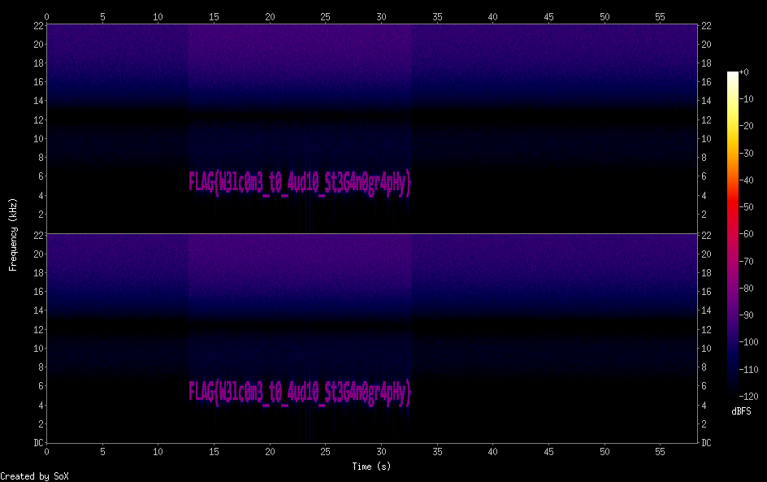

## Question

We found an old cassette with some music recordings in it (probably recorded before the pandemic, to tell you how old it is). We think there might be some message hidden in the music, but we're not sure what kind of message it is. Could you help us extract it?

Oh also, we managed to find the original recording (without the hidden message), if that can help you in your search.

## Solution

We can use sox to diff the two wav files and then produce a spectrogram of the result.

```
sox -m -v 1 original.wav -v -1 secret.wav diff.wav
sox diff.wav -n spectrogram -o diff.png
```
The flag is shown in the spectrogram.

